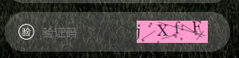

# canvas verification code


## Installation

Install for node.js or browserify using `npm`:

``` bash
$ npm install validatecode
```
## Getting started
Let's see its HTML:
```html
<canvas id="canvas" ></canvas>
```
```javascript
import ValidateCode from 'validatecode'
let canvas = document.querySelector('#canvas')
let validateCode = new ValidateCode(canvas, (code) => {
  console.log(code) // this validateCode
})
```

## API

### validateCode(dom, callback, fontSize, len)

- `dom` (`dom`) 
- `callback` (`Function`)
  - `str` (`String`) validateCode string
- `fontSize` validateCode fontSize
- `len` validateCode length

### verification code

### Click on the switch

